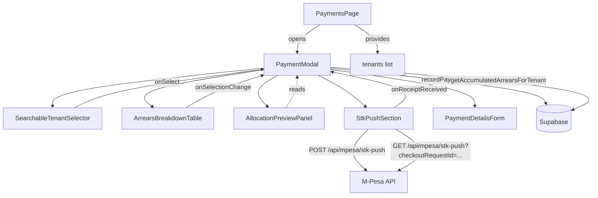

# Design Document: Ultra Rent Payment Modal

## Overview

The Ultra Rent Payment Modal is a comprehensive upgrade to the existing "Record Rent Payment" modal in the ARMS (Alpha Rental Management System) web application. The upgrade adds vacation month awareness, a full arrears breakdown table with selectable months, a searchable tenant selector, a real-time allocation preview, and a working M-Pesa STK Push integration.

All new functionality is additive — the existing `recordPayment` FIFO logic, `RentReceipt` component, and payment notes format are preserved. The design leverages existing Supabase functions (`getAccumulatedArrearsForTenant`, `recordPayment`, `getTenants`, `isVacationMonth`, `getEffectiveRent`) and the already-implemented `/api/mpesa/stk-push` endpoint.

### Key Design Decisions

- **No new API routes or DB schema changes** — all required infrastructure already exists.
- **Component decomposition** — the monolithic modal JSX is split into focused sub-components for maintainability.
- **Controlled state in parent** — `PaymentsPage` owns all modal state; sub-components receive props and callbacks.
- **Real-time preview via pure calculation** — allocation preview is computed synchronously from local state, no extra network calls.
- **STK Push polling via `setInterval`** — a 3-second interval polls the existing GET endpoint; the interval is cleared on success, failure, or modal close.

---

## Architecture



The `PaymentsPage` component is the single source of truth. It passes the full tenant list (loaded once on page mount) down to the modal. The modal manages its own internal state for the form, arrears data, selected months, and STK push status.

---

## Components and Interfaces

### 1. PaymentsPage (enhanced)

**New responsibilities:**
- Detect vacation month on mount using `isVacationMonth(currentMonth)`.
- Render `VacationBanner` when current month is a vacation month.
- Pass full active tenant list to `PaymentModal`.

**No changes** to existing payment list rendering, stat cards, or data loading logic.

---

### 2. VacationBanner

A stateless display component rendered in the `PaymentsPage` header.

```typescript
interface VacationBannerProps {
  // No props — reads nothing from outside; visibility is controlled by parent conditional render
}
```

Renders only when `isVacationMonth(currentMonth)` is `true`. Uses an amber/yellow gradient background with a 🏖️ icon.

---

### 3. PaymentModal (refactored)

The main modal container. Owns all form state and orchestrates sub-components.

```typescript
interface PaymentModalProps {
  isOpen: boolean;
  onClose: () => void;
  tenants: Tenant[];           // pre-loaded active tenants from PaymentsPage
  locationId: number | null;
  onPaymentRecorded: () => void; // triggers parent data reload
}

interface PaymentModalState {
  // Tenant selection
  selectedTenantId: number | null;
  tenantSearchQuery: string;

  // Arrears
  arrearsData: AccumulatedArrearsResult | null;
  loadingArrears: boolean;
  selectedMonths: Set<string>;  // billing_month strings e.g. "2024-03"

  // Payment form
  amount: string;
  paymentMethod: 'Cash' | 'M-Pesa' | 'Bank Transfer' | 'Cheque';
  mpesaReceipt: string;
  mpesaPhone: string;
  referenceNo: string;
  notes: string;
  paymentMonth: string;         // YYYY-MM

  // STK Push
  stkStatus: 'idle' | 'sending' | 'pending' | 'success' | 'failed';
  stkCheckoutRequestId: string | null;
  stkError: string | null;
  stkPollingInterval: ReturnType<typeof setInterval> | null;
}
```

---

### 4. SearchableTenantSelector

A custom combobox component. Filters the pre-loaded tenant list client-side — no additional network calls.

```typescript
interface SearchableTenantSelectorProps {
  tenants: Tenant[];
  selectedTenantId: number | null;
  onSelect: (tenantId: number | null) => void;
}
```

**Filter logic:**
```typescript
const filtered = tenants.filter(t =>
  t.tenant_name.toLowerCase().includes(query.toLowerCase()) ||
  (t.phone || '').toLowerCase().includes(query.toLowerCase())
);
```

**Display format per option:**
```
{tenant_name} — {unit_name} · {location_name}   [KES {balance} ▲]  ← arrears badge if balance > 0
```

Keyboard navigation: `ArrowDown`/`ArrowUp` to move through list, `Enter` to select, `Escape` to close dropdown.

---

### 5. ArrearsBreakdownTable

Displays the result of `getAccumulatedArrearsForTenant`. Includes checkboxes for month selection.

```typescript
interface ArrearsBreakdownTableProps {
  arrearsData: AccumulatedArrearsResult;
  selectedMonths: Set<string>;
  onSelectionChange: (months: Set<string>) => void;
  tenantIsOnVacation: boolean;
}
```

**Column layout:**

| # | Column | Notes |
|---|--------|-------|
| 1 | ☐ | Checkbox — only shown for unpaid/partial rows |
| 2 | Month | e.g. "Mar 2024" |
| 3 | Rent Due | `rent_amount` |
| 4 | Amount Paid | `amount_paid` |
| 5 | Balance | `balance` |
| 6 | 🏖️ | Shown when `isVacationMonth(billing_month) && tenantIsOnVacation` |

**Row color coding:**
- Past months with balance > 0: amber/red background (`#fff7ed` / `#fef3c7`)
- Current month: light blue background (`#eff6ff`)
- Fully paid rows: not shown (filtered out by `getAccumulatedArrearsForTenant`)

**Footer row:** Running total of all displayed balances.

---

### 6. AllocationPreviewPanel

A read-only panel that shows a live calculation of how the entered amount will be allocated. All values are computed synchronously from props — no async work.

```typescript
interface AllocationPreviewPanelProps {
  amount: number;
  arrearsData: AccumulatedArrearsResult | null;
  selectedMonths: Set<string>;  // empty = FIFO across all
}

interface AllocationPreview {
  arrearsPaid: number;
  currentRentPaid: number;
  credit: number;
  balanceAfter: number;
}
```

**Calculation logic (mirrors `recordPayment` FIFO):**

```typescript
function calculatePreview(
  amount: number,
  bills: Bill[],
  selectedMonths: Set<string>,
  currentMonth: string
): AllocationPreview {
  const billsToAllocate = selectedMonths.size > 0
    ? bills.filter(b => selectedMonths.has(b.billing_month))
           .sort((a, b) => a.billing_month.localeCompare(b.billing_month))
    : bills.sort((a, b) => a.billing_month.localeCompare(b.billing_month));

  let remaining = amount;
  let arrearsPaid = 0;
  let currentRentPaid = 0;

  for (const bill of billsToAllocate) {
    if (remaining <= 0) break;
    const alloc = Math.min(remaining, bill.balance);
    if (bill.billing_month < currentMonth) arrearsPaid += alloc;
    else currentRentPaid += alloc;
    remaining -= alloc;
  }

  return {
    arrearsPaid,
    currentRentPaid,
    credit: Math.max(0, remaining),
    balanceAfter: Math.max(0, (arrearsData?.totalDue ?? 0) - amount),
  };
}
```

---

### 7. StkPushSection

Handles the M-Pesa STK Push flow: send request, poll status, auto-fill receipt.

```typescript
interface StkPushSectionProps {
  tenantId: number | null;
  amount: string;
  phone: string;
  onPhoneChange: (phone: string) => void;
  onReceiptReceived: (receipt: string) => void;
  status: 'idle' | 'sending' | 'pending' | 'success' | 'failed';
  error: string | null;
  onSend: () => void;
  onRetry: () => void;
}
```

**Status display mapping:**

| Status | UI |
|--------|----|
| `idle` | "Send M-Pesa Payment Prompt" button |
| `sending` | Spinner + "Sending payment prompt…" |
| `pending` | Spinner + "Waiting for payment… (checking every 3s)" |
| `success` | ✓ green badge + "Payment received! Receipt auto-filled." |
| `failed` | ✗ red badge + error message + Retry button |

---

## Data Models

### Existing types (from `supabase.ts`)

```typescript
// Return type of getAccumulatedArrearsForTenant
interface AccumulatedArrearsResult {
  bills: Bill[];
  arrearsTotal: number;
  currentMonthDue: number;
  totalDue: number;
  arrearsMonths: string[];
  hasVirtualBills: boolean;
  virtualMonths: string[];
}

interface Bill {
  billing_id: number | null;
  tenant_id: number;
  billing_month: string;       // "YYYY-MM"
  billing_date: string;
  due_date: string;
  rent_amount: number;
  amount_paid: number;
  balance: number;
  status: 'Unpaid' | 'Partial' | 'Paid' | 'Unbilled';
  _virtual: boolean;           // true = no DB row yet
}

interface Tenant {
  tenant_id: number;
  tenant_name: string;
  phone: string | null;
  balance: number;
  is_on_vacation: boolean;
  arms_units: { unit_name: string };
  arms_locations: { location_name: string };
  monthly_rent: number;
  status: 'Active' | 'Inactive';
}
```

### STK Push tracking (existing `arms_stk_requests` table)

```typescript
interface StkRequest {
  checkout_request_id: string;
  merchant_request_id: string;
  phone: string;
  amount: number;
  account_reference: string;
  tenant_id: number | null;
  status: 'Pending' | 'Success' | 'Failed';
  result_code: number | null;
  result_desc: string | null;
  mpesa_receipt: string | null;
  raw_response: object;
  created_at: string;
}
```

### STK Push API response shape

```typescript
// POST /api/mpesa/stk-push — success
interface StkPushResponse {
  MerchantRequestID: string;
  CheckoutRequestID: string;
  ResponseCode: string;        // "0" = accepted
  ResponseDescription: string;
  CustomerMessage: string;
}

// GET /api/mpesa/stk-push?checkoutRequestId=... — query result
interface StkQueryResponse {
  ResponseCode: string;
  ResultCode: string;          // "0" = success, "1032" = cancelled
  ResultDesc: string;
  // On success, the callback will have populated arms_stk_requests
}
```

---

## Correctness Properties

*A property is a characteristic or behavior that should hold true across all valid executions of a system — essentially, a formal statement about what the system should do. Properties serve as the bridge between human-readable specifications and machine-verifiable correctness guarantees.*

### Property 1: Vacation banner visibility matches vacation month

*For any* current month string in `YYYY-MM` format, the vacation banner SHALL be displayed if and only if the two-digit month component extracted from that string is in `['05', '06', '07', '08']`.

**Validates: Requirements 1.1, 1.4**

---

### Property 2: Effective rent is halved for vacation tenants in vacation months

*For any* positive base rent value and any billing month whose two-digit month component is in `['05', '06', '07', '08']`, calling `getEffectiveRent(rent, month, true)` SHALL return exactly `Math.round(rent * 0.5 * 100) / 100`. For any non-vacation month or `isOnVacation = false`, it SHALL return the full base rent unchanged.

**Validates: Requirements 2.4**

---

### Property 3: Tenant search filter returns only matching tenants

*For any* list of tenant objects and any non-empty query string, the filtered result SHALL be a subset of the original list where every returned tenant has either their `tenant_name` or `phone` field containing the query string (case-insensitive). No tenant that does not match SHALL appear in the result.

**Validates: Requirements 5.3**

---

### Property 4: Tenant selector option renders all required display fields

*For any* tenant object with `tenant_name`, `arms_units.unit_name`, and `arms_locations.location_name` fields, the rendered dropdown option string SHALL contain all three values.

**Validates: Requirements 5.4**

---

### Property 5: Arrears badge shown if and only if tenant has outstanding balance

*For any* tenant object, the arrears badge SHALL be rendered in the selector option if and only if the tenant's `balance` is strictly greater than zero.

**Validates: Requirements 5.5**

---

### Property 6: Allocation preview conserves the payment amount

*For any* payment amount ≥ 0 and any arrears dataset, the sum `arrearsPaid + currentRentPaid + credit` computed by `calculatePreview` SHALL equal the original payment amount, within a tolerance of ±0.01 (two decimal places of floating-point rounding). The `balanceAfter` value SHALL equal `max(0, totalDue - amount)` and SHALL never be negative.

**Validates: Requirements 8.2, 8.4, 8.6, 8.7**

---

### Property 7: Selected-month allocation only touches selected months

*For any* payment amount and any non-empty set of selected months, every bill allocated by `calculatePreview` SHALL have its `billing_month` in the selected months set. No bill outside the selected months SHALL receive any allocation.

**Validates: Requirements 4.6**

---

### Property 8: Arrears table footer total equals sum of displayed balances

*For any* array of bill objects passed to `ArrearsBreakdownTable`, the footer running total displayed SHALL equal the arithmetic sum of all `balance` values in the array, rounded to two decimal places.

**Validates: Requirements 3.7, 4.3**

---

### Property 9: STK Push request payload contains all required fields

*For any* valid tenant and payment amount, the request body sent to `/api/mpesa/stk-push` SHALL contain non-empty values for `phone`, `amount`, `tenantId`, `accountReference`, and `transactionDesc`.

**Validates: Requirements 6.3**

---

### Property 10: KES currency formatting matches expected pattern

*For any* non-negative number, the formatted output from the currency formatter SHALL match the pattern `KES {digits with comma thousand separators}` (e.g., `KES 15,000` or `KES 1,234,567`).

**Validates: Requirements 8.5**

---

## Error Handling

### Tenant Fetch Failure
- `getTenants` is called by `PaymentsPage` on mount. On failure, a `toast.error` is shown and the tenant list remains empty. The modal "Record Payment" button is disabled when no tenant is selected.

### Arrears Fetch Failure
- `getAccumulatedArrearsForTenant` is called when a tenant is selected. On failure, `arrearsData` is set to `null`, the arrears table shows a fallback message ("Could not load arrears — payment will use FIFO allocation"), and the modal remains usable.

### STK Push Send Failure
- The `POST /api/mpesa/stk-push` call may fail due to missing credentials, network error, or M-Pesa API rejection. On failure, `stkStatus` transitions to `'failed'`, the error message from the API response is displayed, and a Retry button is shown.

### STK Push Poll Timeout
- Polling runs for a maximum of 2 minutes (40 × 3-second intervals). If no terminal status is received, polling stops, `stkStatus` is set to `'failed'`, and the user is prompted to enter the receipt manually.

### Payment Record Failure
- If `recordPayment` throws, the modal stays open, a `toast.error` is shown with the error message, and no receipt is generated.

### Validation Errors
- Inline validation before submission:
  - No tenant selected → `toast.error('Please select a tenant')`
  - No amount → `toast.error('Please enter a payment amount')`
  - Amount ≤ 0 → `toast.error('Payment amount must be greater than zero')`
  - STK Push with no phone → `toast.error('Phone number required for STK Push')`

---

## Testing Strategy

### Unit Tests

Focus on pure functions and isolated component behavior:

- `isVacationMonth(month)` — verify returns `true` for months 05–08, `false` otherwise.
- `getEffectiveRent(rent, month, isOnVacation)` — verify 50% reduction for vacation tenants in vacation months, full rent otherwise.
- `calculatePreview(amount, bills, selectedMonths, currentMonth)` — verify conservation of amount, correct arrears/current split, correct credit calculation.
- `SearchableTenantSelector` filter logic — verify subset property and case-insensitivity.
- `ArrearsBreakdownTable` — verify correct row count, color classes, and vacation icon presence.
- `AllocationPreviewPanel` — verify displayed values match `calculatePreview` output.

### Property-Based Tests

Using **fast-check** (TypeScript PBT library). Each test runs a minimum of **100 iterations**.

**Tag format:** `// Feature: ultra-rent-payment-modal, Property {N}: {property_text}`

- **Property 1** — Generate random month strings; assert banner visibility ↔ month in vacation set.
- **Property 2** — Generate random `monthly_rent` values and vacation months; assert `getEffectiveRent` returns exactly `round(rent * 0.5, 2)`.
- **Property 3** — Generate random tenant lists and query strings; assert filter output is a subset with every item matching the query.
- **Property 4** — Generate random amounts and bill arrays; assert `arrearsPaid + currentRentPaid + credit === amount` (±0.01 for float rounding).
- **Property 5** — Generate random amounts, bill arrays, and month selections; assert selected-month allocation only touches selected months.
- **Property 6** — Generate random amounts and `totalDue` values; assert `balanceAfter = max(0, totalDue - amount)`.
- **Property 7** — Generate random tenant objects; assert arrears badge shown ↔ `balance > 0`.

### Integration Tests

- Modal opens, tenant is selected, arrears table renders with correct row count (example-based, using mock Supabase responses).
- STK Push flow: send → poll → success → receipt auto-fill (mock fetch).
- Payment recording: verify `recordPayment` is called with correct arguments when "Record Payment" is clicked.
- Backward compatibility: verify existing callback-linked payment flow still works after refactor.

### Manual / Visual Tests

- Vacation banner visibility on a vacation-month date vs. non-vacation date.
- Responsive layout on mobile (375px), tablet (768px), and desktop (1280px).
- Keyboard navigation in `SearchableTenantSelector` (arrow keys, enter, escape).
- Smooth transitions on STK Push status changes.
